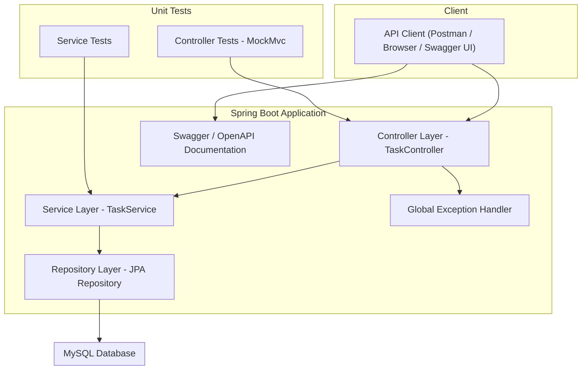

# TodoApp – Task Management REST API
### A lightweight Spring Boot application providing CRUD operations and task filtering capabilities.

## Introduction
TodoApp is a backend-only Task Management API built using Spring Boot. It provides essential functionality for creating, updating, deleting, and retrieving tasks, along with pagination and date-based filtering. The project follows a layered architecture (Controller → Service → Repository) and includes global exception handling, API documentation via OpenAPI/Swagger, and unit tests at both the controller and service levels.

This project is the first in a three-project backend progression, emphasizing clean architecture and production-quality practices.

---

## System Architecture



---

## Features
- Create, retrieve, update, and delete tasks  
- Full and partial updates (PUT & PATCH)  
- Pagination support for listing tasks  
- Retrieve completed and uncompleted tasks  
- Filter tasks by date range  
- Global exception handling  
- OpenAPI/Swagger documentation  
- Unit tests for controller and service layers  

---

## Tech Stack

| Component | Technology |
|----------|------------|
| **Language** | Java 21 |
| **Framework** | Spring Boot 3.5.7 |
| **Build Tool** | Maven |
| **Database** | MySQL |
| **ORM** | Spring Data JPA |
| **Validation** | Jakarta Validation |
| **Documentation** | SpringDoc OpenAPI |
| **Utility** | Lombok |

---

## API Endpoints

### Create Task
```
POST /tasks/create
```

### Get All Tasks (Paginated)
```
GET /tasks/?page=0&size=10
```

### Get Task by ID
```
GET /tasks/{id}
```

### Update Task (Full)
```
PUT /tasks/update/{id}
```

### Update Task (Partial)
```
PATCH /tasks/update/{id}
```

### Delete Task
```
DELETE /tasks/delete/{id}
```

### Get Completed Tasks
```
GET /tasks/completed
```

### Get Uncompleted Tasks
```
GET /tasks/uncompleted
```

### Filter Tasks by Date Range
```
GET /tasks/filter?startDate=YYYY-MM-DD&endDate=YYYY-MM-DD
```

---

## Running the Application

### 1. Clone the Repository
```
git clone https://github.com/Sisir1232/ToDoApp.git
cd todoapp
```

### 2. Configure MySQL
Update `application.properties`:

```
spring.datasource.url=jdbc:mysql://localhost:3306/todoapp
spring.datasource.username=${DB_USERNAME}
spring.datasource.password=${DB_PASSWORD}
spring.jpa.hibernate.ddl-auto=update
```

### 3. Run the Application
Using Maven:
```
mvn spring-boot:run
```

Or via IDE by running:
```
TodoappApplication.java
```

---

## API Documentation
Swagger UI available at:

```
http://localhost:8080/swagger-ui/docs
```

---

## Testing
The project includes unit tests for both the service and controller layers.  
Tests validate:
- Successful retrieval of tasks by ID  
- Controller responses using MockMvc  

While “Not Found” scenarios are not yet tested, the current tests demonstrate correctness and reliability of the implemented features.

---

## Future Improvements
- Implement authentication (JWT)  
- Add sorting and keyword search  
- Introduce task priority levels  
- Add DTO mapping for cleaner responses  
- Build a frontend interface (React, Vue, etc.)  

---

## License
This project is not distributed under a specific license.

